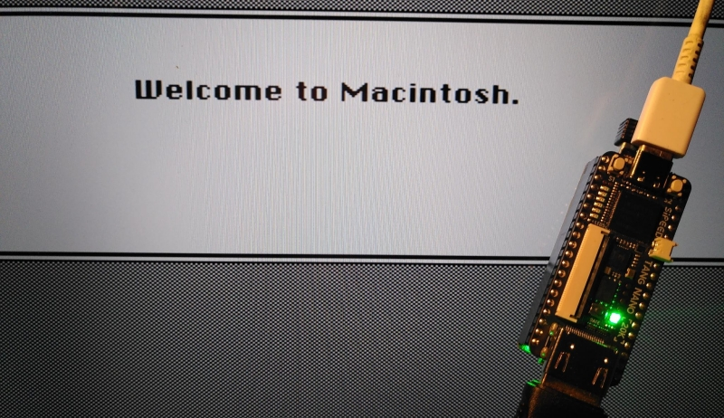

# NanoMac

> Ich sei, gewährt mir die Bitte, in Eurem Bunde der Dritte. Friedrich Schiller

NanoMac is a port of the [PlusToo](https://www.bigmessowires.com/2012/12/15/plus-too-files/) Apple Macintosh Plus FPGA implementation to the [Tang Nano 20K](https://wiki.sipeed.com/hardware/en/tang/tang-nano-20k/nano-20k.html) FPGA development boards.



This is based on the [MiSTeryNano project](https://github.com/harbaum/MiSTeryNano/) and also relies on a [FPGA companion](http://github.com/harbaum/FPGA-Companion) to be connected to the FPGA board for USB support and on-screen-display control.

This version is based on the [MiSTer port of PlusToo](https://github.com/MiSTer-devel/MacPlus_MiSTer) which in turn
was based on the [MiST port of PlusToo](https://github.com/mist-devel/plus_too). Major changes over these versions have been done to clean-up major parts of the design like video timing, memory access speed, floppy implementation and the like with many more changes to come.

Current state:

  * PlusToo core working
  * ROM stored in flash ROM
  * 128k, 512k, 1M or 4M ram configurable
  * Read and write support for two floppy disk images in DSK format
  * HDMI video using the original 512x342p@60Hz mode
  * Keyboard and Mouse via USB
  * [Fully simulated](sim)
  * Two SCSI harddisks
  * Serial/WiFi modem support
  * MIDI support	

## Videos

  * [NanoMac #5: Cubase MIDI on the FPGA Macintosh Plus](https://www.youtube.com/shorts/UlvpvIBvGq8)
  * [NanoMac #4: Over a decade of classic Macintosh gaming](https://www.youtube.com/shorts/HzZ7NqMPe5g)	
  * [NanoMac #3: Arkanoid on FPGA Apple Mac Plus](https://www.youtube.com/shorts/oIGm2tQEABU)
  * [NanoMac #2: Mac Plus on a tiny FPGA](https://www.youtube.com/shorts/Lqf23NVxUAg)
  * [NanoMac #1: First boot of Apple Mac Plus on Tang Nano 20k](https://www.youtube.com/shorts/wxhe5facZ5A)

## What's needed?

  * The Tang Nano 20k to run the PlusToo core itself
    * ```nanomac.fs``` needs to be flashed to the FPGA's flash memory
      * ```openFPGALoader -f nanomac.fs```
    * A mac plus rom (e.g. ```plusrom.bin``` from the original PlusToo archive) needs to be flashed to offset 0x480000
      * ```openFPGALoader --external-flash -o 0x480000 plusrom.bin```
  * A support MCU for USB keyboard and mouse and overall system control      
     * Attached via breadboard or e.g. through a [custom carrier board](https://github.com/harbaum/MiSTeryNano/tree/main/board/misteryshield20k_lite)
     * Running the [FPGA Companion firmware](http://github.com/harbaum/FPGA-Companion)
  * At least one disk image in ```DSK``` format (819200 bytes in in size) containing e.g. [System 3.0](https://winworldpc.com/product/mac-os-0-6/system-3x) has to be placed on an SD card
  * Optionally add a SCSI harddisk image like [MacPack's boot.vhd](https://archive.org/details/macpack)
