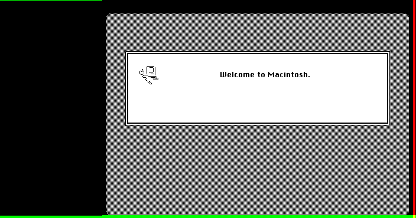
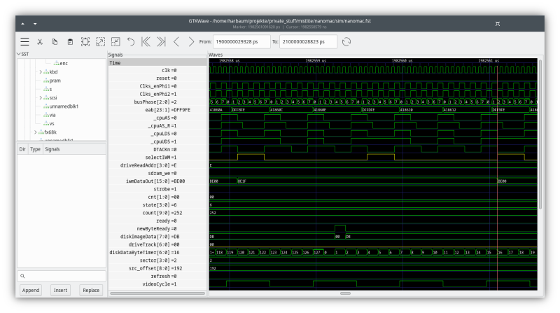

# NanoMac verilator simulation

The entire NanoMac can be run in a [verilator
simulation](https://www.veripool.org/verilator/) on a regular PC. The
simulation includes video, audio, RAM, ROM, SD card etc.  and can thus
be used to verify the general timing and operation of all of these in
a convenient way.

Video is displayed "live" (as live as it can be when running at 1/100
of the speed on a decent PC) in a window as well as captured frame by
frame into the screenshots directory. This captures the entire frama
including blanking areas and vertical and horizontal sync:



Audio is captured into a file named ```audio.s16``` which contains
a single audio channel captured as 16 bit signed values at 22250 Hertz.
This can be read with tools like [audacity](https://www.audacityteam.org/).

The simulation can be configured inside [nanomac_tb.cpp](nanomac_tb.cpp)
to write traces for a certain time or to enable the use of disk images
or ROMs.



The current configuration expects a ROM named ```plusrom.bin``` as
well as a disk image named ```system30.dsk``` to be present and boots
a 128k RAM setup. Any later system and bigger RAM size will significantly
increase boot and thus simulation times which is not necessary in most
cases.